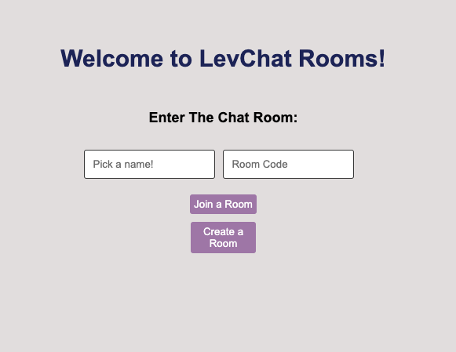
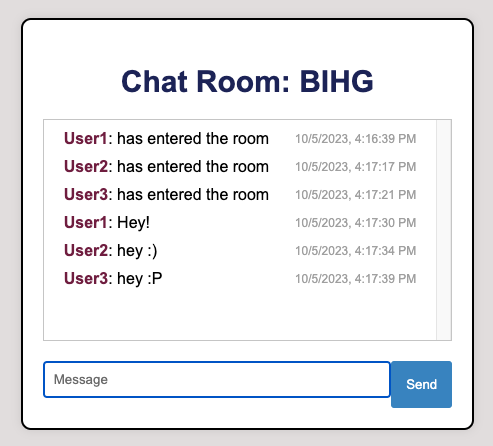
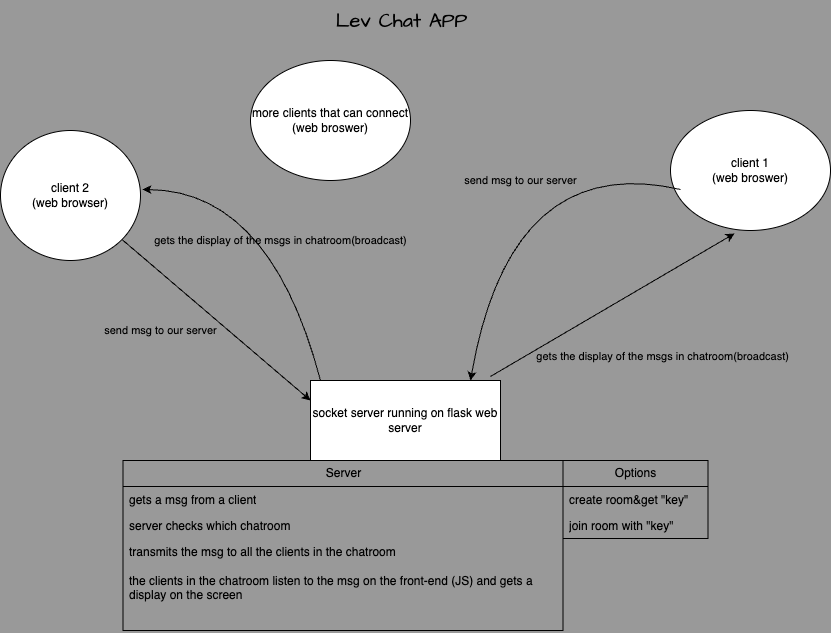

# LevChat - Real-time Chat Room

LevChat is a real-time chat room web application built using Python, Flask and Socket.IO. It allows users to create and join chat rooms where they can exchange messages in real-time.





## Features

- Create a new chat room with a unique random code.
- Join an existing chat room using a room code from your friend.
- Real-time messaging with other users in the same chat room.
- Displays the names of users who are currently in the room.
- Automatic room deletion when all users leave the room.

## Technologies Used

- [Flask](https://flask.palletsprojects.com/en/2.1.x/): A Python web framework used for serving web pages and handling HTTP requests.
- [Socket.IO](https://socket.io/): A library for real-time, bidirectional communication between the server and clients.
- HTML/CSS: Used for designing and structuring the web pages.
- JavaScript: Used for handling client-side functionality and communication with the server.

## How It Works

1. **Home Page**:
   - Users can enter their name and choose to either join an existing chat room by entering a room code or create a new chat room.
   - Validation checks ensure that users provide a name and, if joining a room, a valid room code.

2. **Chat Room**:
   - Users are redirected to a chat room upon successful entry.
   - Real-time messages are displayed in the chat area.
   - Users can send messages by typing in the message input field and clicking the "Send" button.
   - When a user enters or leaves the room, a notification is displayed in the chat.

3. **Server-Side**:
   - Flask handles routing, rendering HTML templates, and processing form submissions.
   - Socket.IO is used to establish WebSocket connections for real-time messaging.
   - Messages are broadcasted to all users in the same chat room using Socket.IO events.

## Setup and Installation

1. Clone the repository to your local machine:

   ```bash
   git clone https://github.com/your-username/levchat.git

2. Install the required Python packages:
 
    ```bash
    pip install -r requirements.txt

3. Run the Flask application:

    ```bash
    python main.py

4. Open your web browser and access the application at http://localhost:5000.

## How It Works (In depth)

**Flask:**

Flask is a Python web framework that allows you to build web applications easily. It is known for its simplicity and flexibility. 

1. `Flask` is imported at the beginning of the script, and an instance of it is created: `app = Flask(__name__)`.

2. Routes are defined using decorators like `@app.route("/")`. These routes determine how different URLs in the application should be handled. For example, `@app.route("/")` specifies what should happen when a user accesses the root URL of my website.

3. I use `render_template` to generate HTML pages. Flask provides a way to render HTML templates with dynamic content.

4. The `app.run()` method at the end starts the Flask application, making it listen for incoming HTTP requests and serving my web pages.

**Socket.IO:**

Socket.IO is a library for real-time, bidirectional communication between the server and the client (web browser). It is typically used for building applications that require live updates or chat features. In my code:

1. `SocketIO` is imported from `flask_socketio`, and an instance of it is created: `socketio = SocketIO(app)`. This instance integrates Socket.IO with my Flask application.

2. Socket.IO enables real-time communication through WebSocket connections, which allow the server to push data to the client and vice versa without the need for the client to continuously poll the server for updates.

3. Socket.IO events are used to define custom messages that can be sent and received between the server and clients. In my code, I have defined several socket.io events, such as `"message"`, `"connect"`, and `"disconnect"`.

**How Flask and Socket.IO Work Together in my Code:**   

In my code, Flask handles the HTTP requests and serves the web pages when a user accesses different routes (e.g., the home page or the chat room page). Socket.IO is used for real-time messaging within the chat room. Here's how they work together:

1. When a user visits the home page (`"/"` route), Flask serves the initial HTML form for entering a name and room code.

2. When the user submits the form to create or join a chat room, Flask processes the form data and stores information about the user and room in the `session` object.

3. Once the user is in a chat room, Socket.IO comes into play. It allows users to send and receive messages in real-time. The `message` event is used to send and receive chat messages.

4. When a user sends a message in the chat room, Socket.IO sends the message data to the server (`@socketio.on("message")`), and the server broadcasts it to all users in the same room.

5. The `connect` and `disconnect` events handle user connections and disconnections from the chat room.

In summary, Flask is responsible for serving web pages and processing HTTP requests, while Socket.IO enables real-time communication between clients and the server, making it suitable for building a chat application where messages are delivered instantly. Together, they create a dynamic and interactive web application.